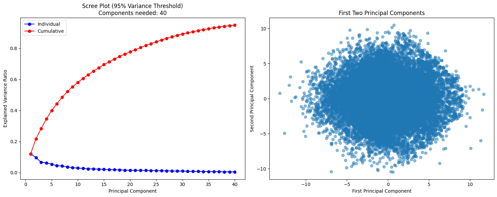
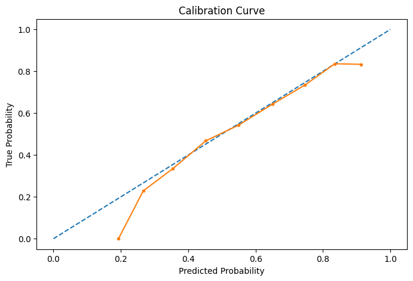
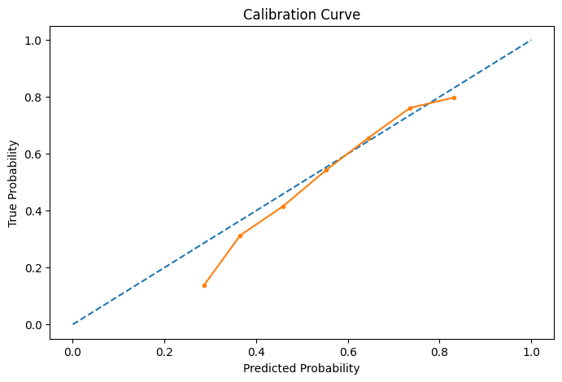
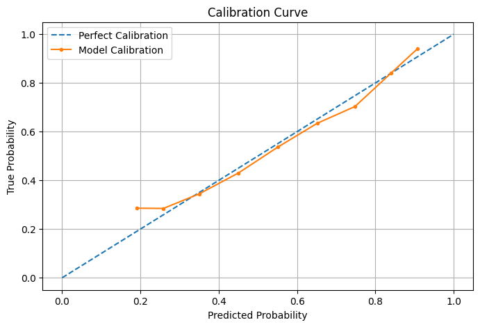

# NBA Data Analysis Documentation

## Overview
This project involves building predictive models and performing exploratory data analysis (EDA) on NBA data to evaluate team and player performance. The workflow integrates machine learning techniques, statistical modeling, and feature engineering, with a focus on Elo ratings, mutual information, and PCA for feature selection.


1. **Cross-validation with PCA**: Applies dimensionality reduction using PCA to retain 95% of variance and evaluates a Random Forest classifier.
2. **Elo Rating Calculation**: Tracks team strength over time using a custom Elo system without data leakage.
3. **Historical Statistics Calculation**: Computes win percentages and game counts for teams up to the current game.

---

## **Code Structure**


### **1. Elo Rating Calculation**
Tracks team Elo ratings chronologically without looking ahead, ensuring no data leakage.

- **Steps**:
  1. Initialize all team ratings to a base value (e.g., 1500).
  2. Adjust team ratings after each game based on the result and the expected score.
  3. Carry over 75% of the previous season's Elo rating to the next season, if applicable.

- **Key Parameters**:
  - `initial_elo`: Starting Elo rating for new teams (default: 1500).
  - `k`: Sensitivity factor for Elo updates (default: 20).
  - `home_advantage`: Elo boost for the home team (default: 100).

- **Key Outputs**:
  - `Elo_Team`: Elo rating of the home team before the game.
  - `Elo_Team.1`: Elo rating of the away team before the game.

- **Code Snippet**:
  ```python
  def calculate_elo_chronologically(data, initial_elo=1500, k=20, home_advantage=100):
      for idx, row in data.iterrows():
          home_team = row['TEAM_NAME']
          away_team = row['TEAM_NAME.1']
          
          home_elo = team_elos.get(home_team, initial_elo)
          away_elo = team_elos.get(away_team, initial_elo)
          
          home_expected = 1 / (1 + 10 ** (-(home_elo - away_elo + home_advantage) / 400))
          home_win = row['Target']
          
          team_elos[home_team] += k * (home_win - home_expected)
          team_elos[away_team] += k * ((1 - home_win) - (1 - home_expected))
  ```

---

### **2. Historical Statistics Calculation**
Calculates win percentages and game counts for each team up to the current game without data leakage.

- **Steps**:
  1. Track team statistics (wins, losses, and total games) for each season.
  2. For each game, store the historical win percentage for both teams before updating their stats.

- **Key Outputs**:
  - `home_win_pct`: Home team's win percentage before the game.
  - `away_win_pct`: Away team's win percentage before the game.
  - `total_games`: Total games played by the home team before the game.

- **Code Snippet**:
  ```python
  def calculate_historical_stats(data):
      for idx, row in data.iterrows():
          home_team = row['TEAM_NAME']
          away_team = row['TEAM_NAME.1']
          
          home_stats = season_stats[season][home_team]
          away_stats = season_stats[season][away_team]
          
          data.at[idx, 'home_win_pct'] = home_stats['wins'] / max(home_stats['games'], 1)
          data.at[idx, 'away_win_pct'] = away_stats['wins'] / max(away_stats['games'], 1)
          data.at[idx, 'total_games'] = home_stats['games']
  ```

---

### **3. Full Data Processing**
Combines all steps into a single function to process the dataset without data leakage.

- **Steps**:
  1. Sort the dataset chronologically by game date.
  2. Apply Elo rating calculation.
  3. Compute historical statistics.

- **Key Outputs**:
  - Processed dataset with Elo ratings and historical stats.

- **Code Snippet**:
  ```python
  def process_data_without_leakage(data):
      data = data.sort_values('Date').copy()
      data = calculate_elo_chronologically(data)
      data = calculate_historical_stats(data)
      return data

  data_processed = process_data_without_leakage(df)
  ```


### **4. Cross-validation with PCA**
This step applies Principal Component Analysis (PCA) and evaluates the model's performance in a cross-validation framework.

- **Steps**:
  1. Split the data into training and validation sets using K-Fold cross-validation.
  2. Apply PCA to retain 95% of variance.
  3. Train a Random Forest classifier on the PCA-reduced data.
  4. Evaluate validation accuracy and store PCA feature importance.

- **Key Outputs**:
  - Validation scores (`cv_scores`)
  - Number of components for 95% variance (`cv_n_components`)
  - Feature importance from PCA (`cv_feature_importance`)

- **Code Snippet**:
  ```python
  for fold, (train_idx, val_idx) in tqdm(enumerate(kf.split(X_scaled)), total=n_splits, desc="Cross-validation"):
      X_train = X_scaled[train_idx]
      X_val = X_scaled[val_idx]
      y_train = target.iloc[train_idx]
      y_val = target.iloc[val_idx]
      
      pca = PCA(n_components=0.95)
      X_train_pca = pca.fit_transform(X_train)
      X_val_pca = pca.transform(X_val)
      
      clf = RandomForestClassifier(n_estimators=100, random_state=42, n_jobs=-1)
      clf.fit(X_train_pca, y_train)
      val_score = clf.score(X_val_pca, y_val)
  ```




---

### 5. Machine Learning Models

#### **Models Used**:
1. **Logistic Regression**
2. **Random Forest Classifier**
3. **XGBoost Classifier**
4. **Voting Classifier**

#### **Backtesting Framework**
- Validates models across multiple NBA seasons.
- Performs calibration using `CalibratedClassifierCV` for improved probability estimates.

#### Example Backtest:
```python
def backtest(data, predictors, model, start=3, step=1):
    for i in range(start, len(seasons), step):
        model.fit(train[predictors], train['Home-Team-Win'])
        predictions, predictions_prob = get_predictions(model, test[predictors])
```

#### **6. Neural Network Implementation**
This section adds a neural network to predict NBA game outcomes using TensorFlow/Keras. The model was trained on preprocessed NBA data, and its performance was evaluated using metrics like accuracy, F1 score, and ROC AUC.

**Model Architecture**:
- **Input**: Flattened feature set from preprocessed data.
- **Hidden Layers**: 
  - Layer 1: 512 neurons, `ReLU6` activation, dropout 20%.
  - Layer 2: 256 neurons, `ReLU6` activation, dropout 20%.
  - Layer 3: 128 neurons, `ReLU6` activation.
- **Output Layer**: Softmax activation for categorical classification (home team win or loss).

**Key Steps**:
1. Normalize the input data.
2. Train-test split (80/20).
3. Compile the model with a small learning rate (`0.00001`) to improve stability.
4. Save the best weights during training using the `ModelCheckpoint` callback.
5. Monitor validation loss for early stopping.

**Key Outputs**:
- `Home_Prob`: Predicted probability of a home team win.
- `Target`: Actual game outcome (0 = away team win, 1 = home team win).
- Metrics: Accuracy, F1 score, ROC AUC.

**Code Snippet**:
```python
    # Model architecture
    model = Sequential([
        Flatten(input_shape=(x_train.shape[1],)),
        Dense(512, activation=tf.nn.relu6),
        Dropout(0.2),
        Dense(256, activation=tf.nn.relu6),
        Dropout(0.2),
        Dense(128, activation=tf.nn.relu6),
        Dense(2, activation=tf.nn.softmax)
    ])
```

Here’s an updated and consistent format for **Section 5: Visualization and Evaluation** and **Section 6: Performance Metrics** with a unified analysis and formatting.

---

### **5. Visualization and Evaluation**

#### **Calibration Curve**
The calibration curve evaluates the alignment between predicted probabilities and actual outcomes. A well-calibrated model's curve will align closely with the diagonal, indicating that predicted probabilities accurately reflect true probabilities.

**Code Snippet**:
```python
plot_calibration(results_df)
```

**Observation**:
- The **original features** produce a smoother calibration curve, aligning well with the diagonal, indicating strong reliability in predicted probabilities.
- The **PCA-reduced features** yield a noisier curve, likely due to information loss during dimensionality reduction, but still provide reasonable alignment.
- The **neural network** demonstrates improved calibration over the PCA features, reflecting better probability predictions.

**Calibration Curve Visualizations**:
1. **Original Features**:

   

2. **PCA-Reduced Features**:

   

3. **NN Model Original Features**

   


---

#### **ROC Curve**
The ROC (Receiver Operating Characteristic) curve shows the tradeoff between the true positive rate (TPR) and false positive rate (FPR) across various classification thresholds. The AUC (Area Under Curve) quantifies the model's ability to rank predictions correctly.

**Code Snippet**:
```python
plot_roc_curve(results_df)
```

**Observation**:
- The **original features** achieve a higher AUC (0.619), indicating better ranking ability.
- The **PCA-reduced features** show a reduced AUC (0.584), highlighting the tradeoff for dimensionality reduction.
- The **neural network** achieves the highest AUC (0.7055), showcasing its ability to model complex relationships and rank predictions effectively.

**ROC Curve Visualization**:


---

### **6. Performance Metrics**

This section summarizes the evaluation metrics for models trained using the original features, PCA-reduced features, and the neural network. Metrics include accuracy, F1 score, and ROC AUC.

#### **Original Features**
- **Accuracy**: 0.639
- **F1 Score**: 0.707
- **AUC**: 0.619
- **Analysis**:
  - The model performs well on ranking tasks (AUC) and achieves balanced predictions (F1 score).
  - The calibration curve is smooth and closely aligned with the diagonal, indicating reliable probability predictions.

---

#### **PCA-Reduced Features**
- **Accuracy**: 0.619
- **F1 Score**: 0.715
- **AUC**: 0.584
- **Analysis**:
  - Dimensionality reduction slightly reduces accuracy and AUC due to potential loss of predictive variance.
  - The improved F1 score suggests better performance on balanced predictions, especially for imbalanced scenarios.

---

#### **Neural Network**
- **Accuracy**: 0.6599
- **F1 Score**: 0.7174
- **AUC**: 0.7055
- **Analysis**:
  - The neural network outperforms both the original and PCA-reduced feature models in terms of AUC, demonstrating its superior ability to rank predictions.
  - A higher F1 score reflects its strength in handling imbalanced data while achieving balanced predictions.
  - The training and validation losses stabilize due to early stopping, indicating effective regularization and prevention of overfitting.

**Neural Network Progression**:


---

### **Summary of Results**
| Model                | Accuracy | F1 Score | AUC    | Calibration | Notes                                      |
|----------------------|----------|----------|--------|-------------|--------------------------------------------|
| Original Features    | 0.639    | 0.707    | 0.619  | Smooth      | Reliable ranking and probability prediction|
| PCA-Reduced Features | 0.619    | 0.715    | 0.584  | Noisier     | Improved F1 but reduced ranking ability    |
| Neural Network       | 0.6599   | 0.7174   | 0.7055 | Improved    | Best overall performance, especially in ranking|

---

### Next Steps:
1. **Neural Network Optimization**:
   - Experiment with different architectures, such as deeper layers or residual connections.
   - Use hyperparameter tuning to optimize learning rate, batch size, and dropout rates.

2. **Feature Selection**:
   - Explore advanced techniques such as sequential feature selection (SFS) to identify key predictors and improve model interpretability.

3. **Cross-Validation**:
   - Validate all models across multiple folds to ensure robust generalization.

4. **Combine Models**:
   - Integrate the neural network with traditional ensemble methods like voting classifiers or stacking to further enhance performance.

This updated documentation provides a structured comparison of all models with consistent analysis and formatting. Let me know if you need further updates or refinements!

### **Future Work**

#### **2. Exploring Sequential Feature Selection (SFS)**
To identify the most informative features, I will experiment with **Sequential Feature Selection** (SFS). This technique adds or removes features iteratively to optimize model performance.

- **Steps**:
  1. Use scikit-learn's `SequentialFeatureSelector` with models like Logistic Regression or Random Forest as the estimator.
  2. Perform both **forward selection** (starting with an empty set of features) and **backward elimination** (starting with all features).
  3. Compare the selected features with those identified by PCA and mutual information.

- **Metrics for Evaluation**:
  - Accuracy, F1 Score, and AUC for the selected feature subset.
  - Computational efficiency compared to PCA.

- **Code Snippet**:
  ```python
  from sklearn.feature_selection import SequentialFeatureSelector
  from sklearn.ensemble import RandomForestClassifier

  def perform_sfs(X, y):
      clf = RandomForestClassifier(n_estimators=100, random_state=42)
      sfs = SequentialFeatureSelector(clf, n_features_to_select=10, direction='forward', cv=5)
      sfs.fit(X, y)
      selected_features = sfs.get_support(indices=True)
      return selected_features
  ```

- **Expected Benefits**:
  - Identifies specific features that contribute most to predictive performance.
  - Can complement PCA by selecting interpretable features in the original feature space.

---


